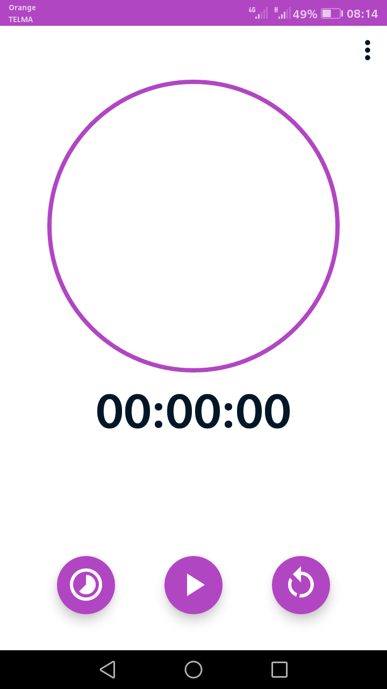
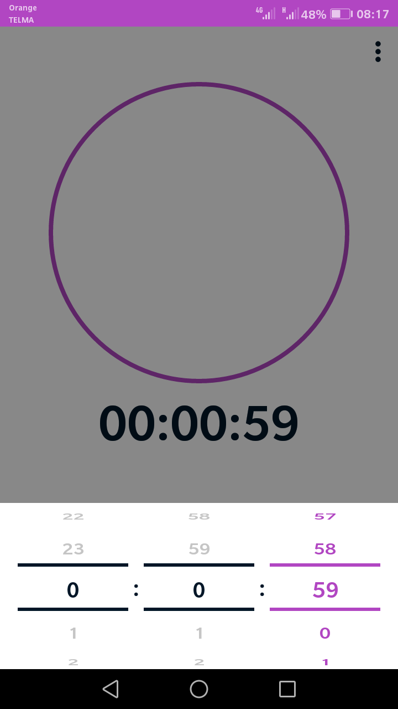
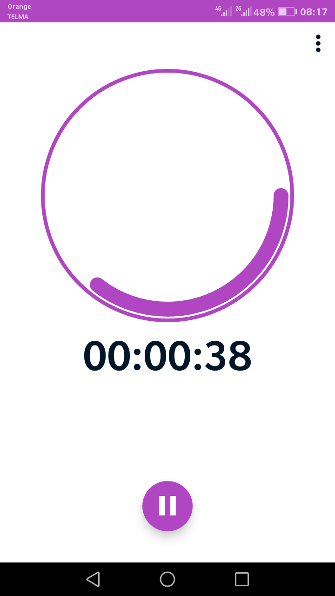
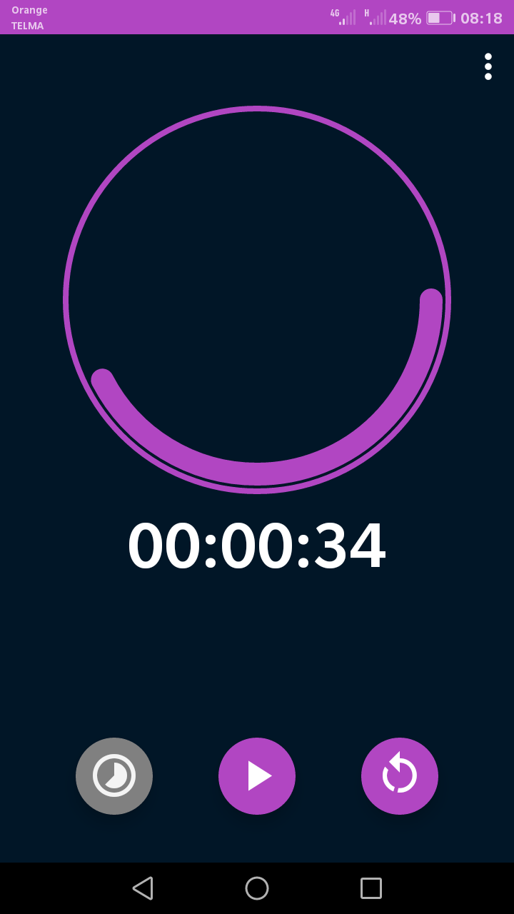
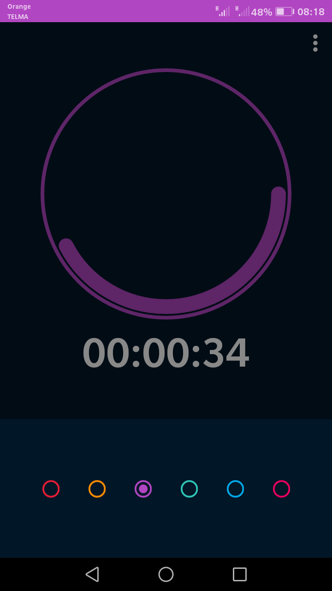

# UTimer

A simple timer mobile app build with react native

## Screenshots:

## How to use:

It's been a while since i didn't used react native so hosnestly, at the time imma writing this I don't know.
But if you ever wanted to run this project pease refer to the [react-native documentation](https://reactnative.dev/docs/getting-started).
Otherwise, you could also like to test directly the [**releases apks**](https://github.com/radandevist/utimer/releases/tag/alpha).

I will update this section later.